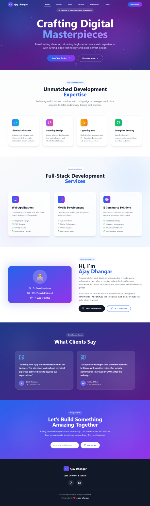

# 🚀 Modern Landing Page - Ajay Dhangar

Welcome to the Modern Landing Page project! This is a sleek, responsive, and high-performance web landing page designed and developed to demonstrate full-stack expertise and clean UI/UX practices. Built to inspire trust, elevate branding, and convert visitors into clients.

> 🌐 Crafted by [Ajay Dhangar](https://www.linkedin.com/in/ajay-dhangar) – Transforming digital ideas into pixel-perfect experiences.

## ✨ Features

- ⚡ Clean, professional layout
- 🌈 Gradient-based modern UI
- 📱 Fully responsive design (mobile + desktop)
- 🚀 Performance-optimized (SEO + Core Web Vitals)
- 🧩 Modular components
- 💬 Client testimonials section
- 💼 Services and expertise showcase
- 📩 Contact section with call to action

## 📷 Preview

<!--


-->


## 🛠️ Tech Stack

- **Frontend:** HTML5, CSS3, JavaScript
- **Design Tools:** Figma / Adobe XD (UI inspiration)
- **Responsive Layout:** Flexbox, Grid
- **Fonts & Icons:** Google Fonts, Lucide Icons
- **Deployment:** GitHub Pages / Vercel / Netlify

## 📂 Installation

1. Clone the repository:
   ```bash
   git clone https://github.com/ajay-dhangar/modern-landing-page.git
   cd modern-landing-page
   ```

2. Install dependencies (if any):
   ```bash
   npm install
   ```

3. Start the development server:
   ```bash
   npm run dev
   ```

4. Open your browser and navigate to `http://localhost:5173/` to view the landing page.

Note: This project is designed to be static and does not require a backend server. You can deploy it directly to platforms like GitHub Pages, Vercel, or Netlify.

## 🧠 Use Cases

* Portfolio showcase for developers/designers
* Freelancers or agencies landing page
* Tech startups presentation page
* Personal branding website

## 🚀 Live Demo

> 🌍 [View Live Demo](https://modern-landing-page-ajay.vercel.app)

## 🤝 Contributing

Want to contribute or use this layout in your own project? Go ahead! Attribution appreciated 💜

## 📧 Contact

Feel free to connect with me:

* GitHub: [Ajay-Dhangar](https://github.com/ajay-dhangar)
* LinkedIn: [Ajay Dhangar](https://linkedin.com/in/ajay-dhangar)
* Email: [ajaydhangar49@gmail.com](mailto:ajaydhangar49@gmail.com)

---

**© 2024 Ajay Dhangar — All rights reserved.**

Designed & Developed with ❤️ by [Ajay Dhangar](https://github.com/ajay-dhangar)
